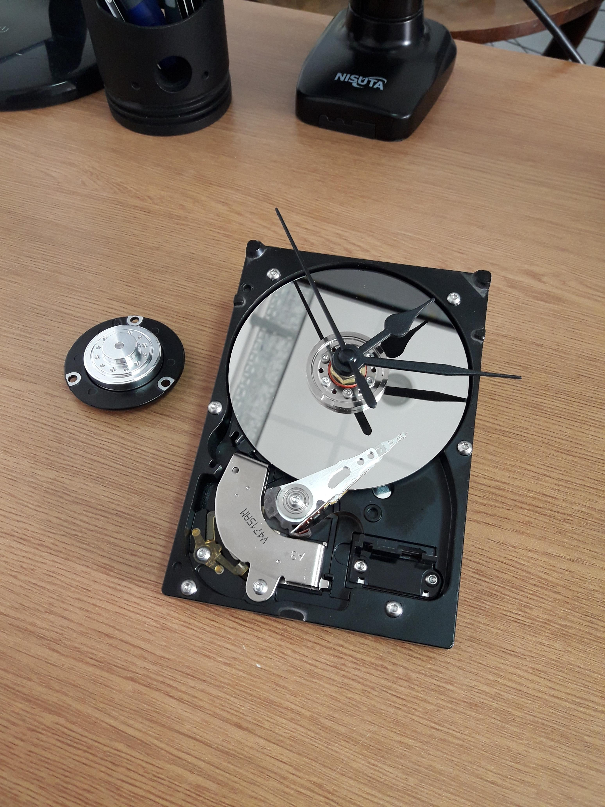

# Recicla un viejo disco duro como reloj de escritorio.

Con el objetivo de hacer la menor cantidad de modificaciones y sin dañar el aparato original, es posible reemplazar el motor y la sección de ajuste del disco por una pieza que permita acoplar una máquina de reloj y convertirlo en un accesorio útil sin emplear más que un destornillador.  

Los modelos paramétricos de las piezas están diseñados en OpenScad, para que puedan corregirse con facilidad y mantener un control de cambios.  

### Modelos:  

_Colabora extendiendo la lista!_

  - WD800BB (Western Digital 80Gb IDE)